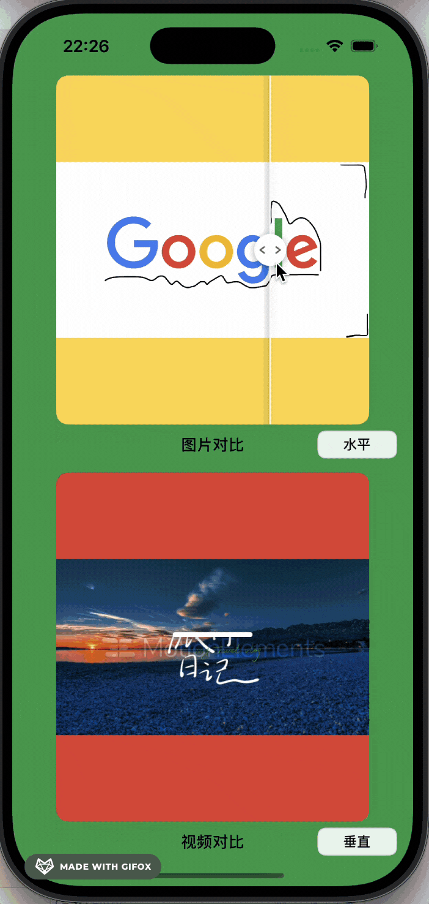

# EffectPreviewView

## 项目简介

`EffectPreviewView` 是一个支持**图片/视频前后对比滑动**的 iOS 视图组件。它可以方便地在同一视图中对比原始与编辑后的图片或视频，通过滑块交互直观展示效果差异，适用于美颜、滤镜、修图、视频特效等场景。

## 演示效果

<div align="center">
  
</div>


- 滑动查看图片和视频的编辑前后对比效果
- 滑块位置可自定义、可动画切换
- 支持自定义滑块样式和遮罩边缘样式（普通、阴影、虚线等）


## 目录结构

```
EffectPreviewView/
├── EffectPreviewV/
│   ├── AppDelegate.swift
│   ├── SceneDelegate.swift
│   ├── ViewController.swift         // 示例页面，演示图片/视频对比用法
│   ├── EffectPreviewView/
│   │   └── EffectPreviewView.swift  // 核心组件，负责对比与滑动逻辑
│   ├── Assets.xcassets/             // 图片资源
│   ├── before_mov.mp4               // 示例视频（原始）
│   ├── after_mov.mp4                // 示例视频（编辑后）
│   └── Info.plist
├── EffectPreviewView.xcodeproj/
└── README.md
```

## 快速开始

1. 将 `EffectPreviewView.swift` 拖入你的项目。
2. 参考如下用法：

```swift
let preview = EffectPreviewView()
preview.setContent(original: 原始图片或视频, edited: 编辑后图片或视频)
preview.onSliderChanged = { position in
    // 监听滑块变化
}
```

测试示例在 `ViewController.swift` 。


## 许可证

MIT License
